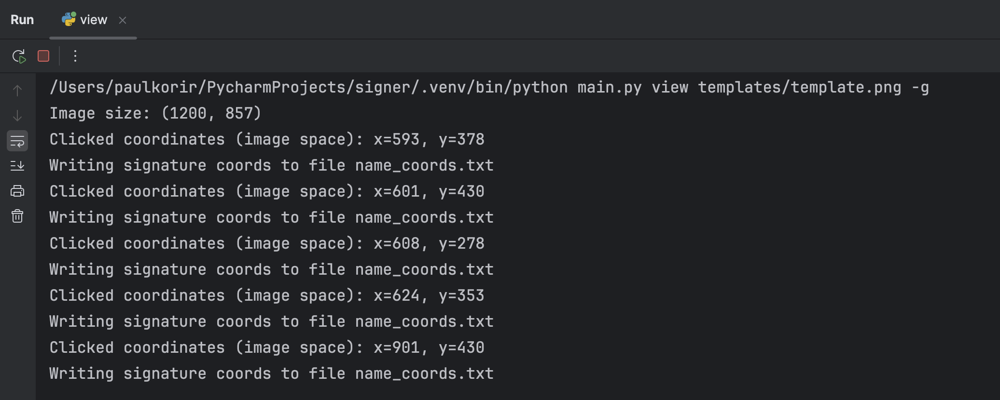

# `signer`
## What?
`signer` is a CLI tool to label certificates quickly and efficiently. You need to provide it with three inputs:
* a CSV file with the *names* of certificate recipients;
* the PNG file of the certificate template including any signatures added by representatives of the endorsing organisations;
* the path to a *truetype font* (`.ttf`) or *open type font* (`.otf`) file of the font to be used to label the certificates.

## Why?
* No need for an internet connection.
* It's quick and efficient.
* Avoid the risk of exposing the recipients' personal information on an online platform.
* No limits on how many certificates you can sign. Most online platforms have a paltry free tier.

## Usage
Presently, there are two commands:
1. `python main.py label` which *labels* a template with names provided from a file.
2. `python main.py view` which displays a template with an optional grid to select where on the template the text will need to appear.
Details on each is provided below.

### Labelling a template
Given a template file, we would like to label it using a list of names provided in a file. This assumes that you know where in the template the text will be placed. If you need to locate the writing position on the template then see the `Viewing a template` section below.

```shell
python main.py label -n names.csv -t templates/template.png -F fonts/arial.ttf -S 60 -O output_dir
```
where
* `-n` is the name of a CSV file with a column of names;
* `-t` is the path to the template file, a PNG image;
* `-F` is the name the font to use and should be a `.ttf` or `.otf`;
* `-S` is the font size;
* `-O` is the name of the directory into which to write the labeled documents.

Below is an example of a labelled template


### Viewing a template
To view the template with an overlaid calibration grid enter:
```shell
python main.py view --show-grid templates/template.png
```

Clicking on any point on the displayed template will capture the coordinates of the labelling position into a file called `name_coords.txt` (as displayed).

